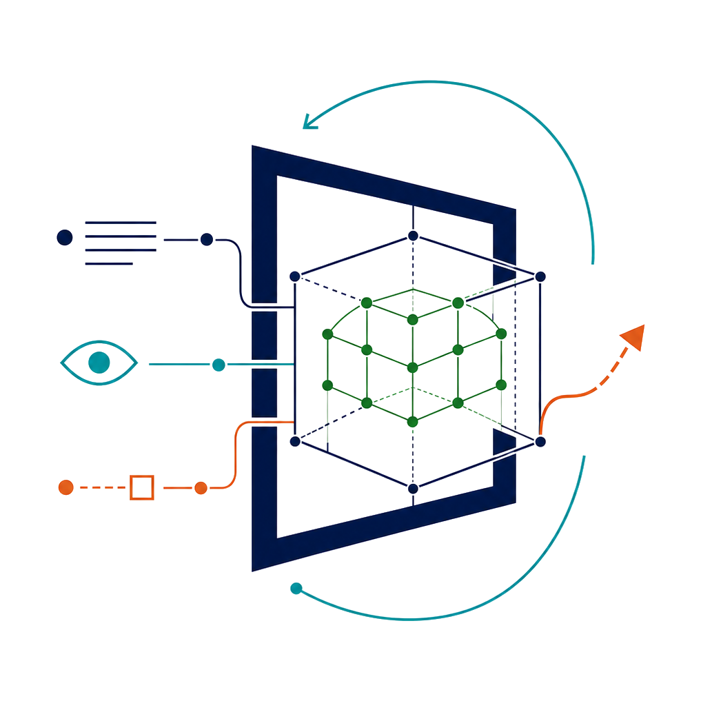

# Awesome Multimodal World Reasoning [](https://awesome.re)

<p align="center">
  <a href="https://romgai.github.io/awesome-multimodal-world-reasoning/">
    
  </a>
</p>

<p align="center">
  An interactive, bilingual literature and evaluation index for world models in multimodal reasoning, simulation, planning, and control.
</p>

<p align="center">
  <a href="https://romgai.github.io/awesome-multimodal-world-reasoning/"><strong>Open the live portal</strong></a>
  ·
  <a href="https://github.com/RomGai/awesome-multimodal-world-reasoning">Repository</a>
</p>

This repository is the interactive companion to **A Survey of World Models in Multimodal Reasoning**. It currently indexes 345 Research Works and 176 Evaluation Resources with functional-role filtering, world-model types, keyword and year search, date sorting, bilingual summaries, structured resource details, pagination, and verified Paper, Code, Project, and Blog links when available.

## Contents

- [Live portal](#live-portal)
- [Organization](#organization)
- [Data and curation](#data-and-curation)
- [Local development](#local-development)
- [Contributing](#contributing)
- [Citation](#citation)
- [License](#license)

## Live portal

The complete index is available at:

**https://romgai.github.io/awesome-multimodal-world-reasoning/**

The portal provides two connected views:

- **Research Works** — world-model methods grouped by their functional roles and technical type.
- **Evaluation Resources** — benchmarks, datasets, environments, simulators, metrics, and evaluation protocols organized by Evaluation Focus.

## Organization

### Primary roles

| Family | Meaning |
| --- | --- |
| TI | Temporal & Imaginative |
| SS | Structured State |
| AC | Action Coupled |

Research Works may receive multiple detailed roles across interactive or imagined rollout, generation or prediction, persistent memory, geometric, physical, causal and relational state, and VLA, robot, driving, navigation, or tool interfaces.

### World model types

- **Generative & Interactive** — produces observable or executable future world states.
- **Latent-Dynamics & Predictive-State** — learns predictive representations or transition states used for reasoning, planning, or control.
- **(M)LLM-Integrated** — places an LLM, MLLM, VLM, or VLA interface inside the world-model loop.

The types are intentionally non-exclusive when a paper implements more than one mechanism.

## Data and curation

- `source-data/` stores the public bibliography and Table 2/3 source records used by the generator.
- `data/curated-additions.json` stores reviewed entries beyond the two survey tables.
- `data/portal-meta.json` stores bilingual summaries and official link overrides.
- `app/data/*.generated.json` contains the generated front-end catalogs.

Classifications and structured details are checked against full papers or official long-form technical documents. Research summaries are neutral, factual, and explicitly marked in the interface as summarized by GPT-5.6 Sol. The repository does not claim official inclusion in the `sindresorhus/awesome` directory.

## Local development

Node.js 22 or newer is required.

```bash
npm ci
npm run dev
```

Open `http://localhost:3000/`. To regenerate the catalogs and run the validation suite plus static build:

```bash
npm test
```

The GitHub Pages workflow deploys the static output from `dist/client/`.

## Contributing

Corrections and additions are welcome. Please read [CONTRIBUTING.md](CONTRIBUTING.md) before opening an issue or pull request. Proposed additions should include an official full-text source and evidence for the requested role or Evaluation Focus.

## Citation

Repository citation metadata is available in [CITATION.cff](CITATION.cff). Citation details for the survey paper will be added when its official publication page becomes available.

## License

The curated catalog, summaries, and documentation are licensed under [CC BY 4.0](LICENSE). Portal source code is licensed separately under the [MIT License](LICENSE-CODE).
