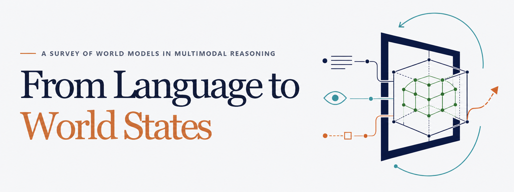

# Awesome Multimodal World Reasoning

<p align="center">
  <a href="https://romgai.github.io/awesome-multimodal-world-reasoning/">
    
  </a>
</p>

<p align="center">
  <em>An interactive literature and evaluation index for world models in multimodal reasoning.</em>
</p>

<p align="center">
  <a href="https://romgai.github.io/awesome-multimodal-world-reasoning/"></a>
  <a href="https://awesome.re"></a>
</p>

This repository is the interactive companion to **A Survey of World Models in Multimodal Reasoning**. It currently indexes 345 Research Works and 176 Evaluation Resources. Every Research Work includes a concise summary in English and Chinese, while Evaluation Resources provide structured details. The portal also supports functional-role filtering, world-model types, keyword and year search, date sorting, pagination, and verified Paper, Code, Project, and Blog links when available.

## Contents

- [Live portal](#live-portal)
- [Organization](#organization)
- [How to add new works](#how-to-add-new-works)
- [Citation](#citation)
- [License](#license)

## Live portal

The complete index is available at:

**https://romgai.github.io/awesome-multimodal-world-reasoning/**

The portal provides two connected views:

- **Research Works** — world-model methods grouped by their functional roles and technical type.
- **Evaluation Resources** — benchmarks, datasets, environments, simulators, metrics, and evaluation protocols organized by Evaluation Focus.

## Organization

### Primary roles

| Family | Meaning |
| --- | --- |
| TI | Temporal & Imaginative |
| SS | Structured State |
| AC | Action Coupled |

Research Works may receive multiple detailed roles across interactive or imagined rollout, generation or prediction, persistent memory, geometric, physical, causal and relational state, and VLA, robot, driving, navigation, or tool interfaces.

### World model types

- **Generative & Interactive** — produces observable or executable future world states.
- **Latent-Dynamics & Predictive-State** — learns predictive representations or transition states used for reasoning, planning, or control.
- **(M)LLM-Integrated** — places an LLM, MLLM, VLM, or VLA interface inside the world-model loop.

The types are intentionally non-exclusive when a paper implements more than one mechanism.

## How to add new works

If a Research Work or Evaluation Resource is missing from the portal, you can request that we add it or submit the data directly.

### 1. Request an addition through an issue

Open a [new GitHub issue](https://github.com/RomGai/awesome-multimodal-world-reasoning/issues/new) and include:

- the name of the work or resource and whether it belongs in **Research Works** or **Evaluation Resources**;
- its official paper, long-form technical document, or official release page;
- official Code and Project links, when available;
- a short explanation of why it belongs in the portal and any roles or Evaluation Focus tags you suggest.

No repository edits are required. We will review the full text, verify the links, determine the classification, prepare the summary or structured resource details, and add accepted entries to the portal.

### 2. Submit a pull request

Please read [CONTRIBUTING.md](CONTRIBUTING.md), then follow these steps if you would like to prepare the portal data yourself.

1. **Fork the repository and create a focused branch.**

   ```bash
   git clone https://github.com/<your-username>/awesome-multimodal-world-reasoning.git
   cd awesome-multimodal-world-reasoning
   git checkout -b data/add-short-name
   ```

2. **Choose the portal view for the new entry.** Do not edit `app/data/*.generated.json` by hand.

   **Research Works**

   - Add its BibTeX record to `source-data/survey.bib`, add the entry under `research` in `data/curated-additions.json`, and add its bilingual summary and official links to `data/portal-meta.json`.
   - Roles must use `TI-I`, `TI-G`, `TI-M`, `SS-G`, `SS-P`, `SS-C`, `SS-E`, `AC-V`, `AC-R`, `AC-D`, `AC-N`, or `AC-T`.

   **Evaluation Resources**

   - Add its BibTeX record to `source-data/survey.bib`, add the entry under `evaluation` in `data/curated-additions.json`, and add official links to `data/portal-meta.json` when available.
   - Evaluation Focus accepts `TI`, `SS`, and `AC`.

   Multiple roles or Focus tags are allowed when supported by the full text. New portal entries always belong in `data/curated-additions.json`; do not append them to the survey-source CSV or TeX files.

3. **Include the required evidence and metadata.**

   - Link the official paper, long-form technical document, or official release page.
   - Base classifications and structured details on the full text, especially Method and Evaluation—not only the title or abstract.
   - Use only author- or institution-maintained Code and Project links, and use HTTPS URLs.
   - For a Research Work, provide a neutral English summary of 80–120 words and a Chinese summary of 140–220 Chinese characters. Do not include offensive language or unsupported claims.
   - For an Evaluation Resource, provide `resourceType`, `target`, `scale`, `task`, and `dimensions` instead of a narrative summary.

4. **Regenerate and validate the portal.** Node.js 22 or newer is required.

   ```bash
   npm ci
   npm test
   ```

   `npm test` regenerates the front-end catalogs and checks identifiers, tags, summaries, links, pagination data, and the static build. Include the regenerated `app/data/*.generated.json` files in the pull request, but never edit them manually.

5. **Commit, push, and open the pull request.**

   ```bash
   git add source-data data app/data
   git commit -m "Add <work-or-resource-name>"
   git push -u origin data/add-short-name
   ```

   On GitHub, select **Compare & pull request**. In the description, state what changed, link the full-text source, cite the sections or pages supporting the tags and details, confirm link ownership, and report that `npm test` passes. Keep each pull request limited to one work, one resource, or one closely related correction whenever possible.

## Citation

Repository citation metadata is available in [CITATION.cff](CITATION.cff). Citation details for the survey paper will be added when its official publication page becomes available.

## License

The curated catalog, summaries, and documentation are licensed under [CC BY 4.0](LICENSE). Portal source code is licensed separately under the [MIT License](LICENSE-CODE).
